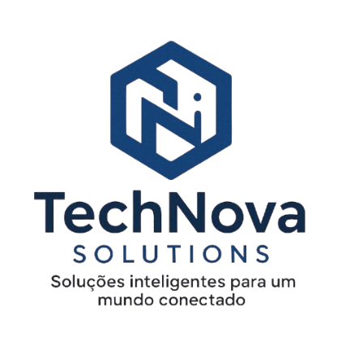

# **TechNova Solutions**  
_Soluções inteligentes para um mundo conectado_  
 

 
---
 
## **Projeto Interdisciplinar - Desenvolvimento de Software Multiplataforma**
 
Este repositório contém os arquivos e documentações do Projeto Interdisciplinar desenvolvido para o curso de **Desenvolvimento de Software Multiplataforma** da **FATEC**.
 
### **Sobre o Projeto**
 
O objetivo deste projeto é aplicar na prática os conhecimentos adquiridos durante o curso, criando uma solução real para um problema identificado. O sistema foi desenvolvido com foco em escalabilidade, usabilidade e boas práticas de programação.
 
> **Tecnologias Utilizadas:**
> - Front-end: React / Flutter / HTML + CSS e Bootsrap
> - Back-end: JavaScript
> - Outras ferramentas: Papel e caneta, Canva 
 
---
 
## **Estrutura do Repositório**
 
```bash
├── /docs         # Documentação do projeto
├── /src          # Código-fonte da aplicação
├── /assets       # Imagens e recursos visuais
├── README.md     # Este arquivo
└── LICENSE       # Licença de uso
 
 
---
 
Equipe TechNova
 
Cauã Porciuncula
 
Erick
 
Gabriela
 
Rafael Lima
 
Maylon Leyn
 
 
 
---
 
© 2025 TechNova Solutions
Todos os direitos reservados.
